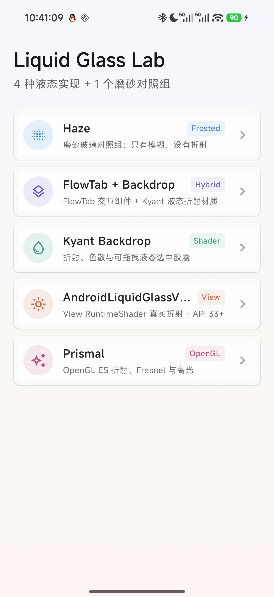
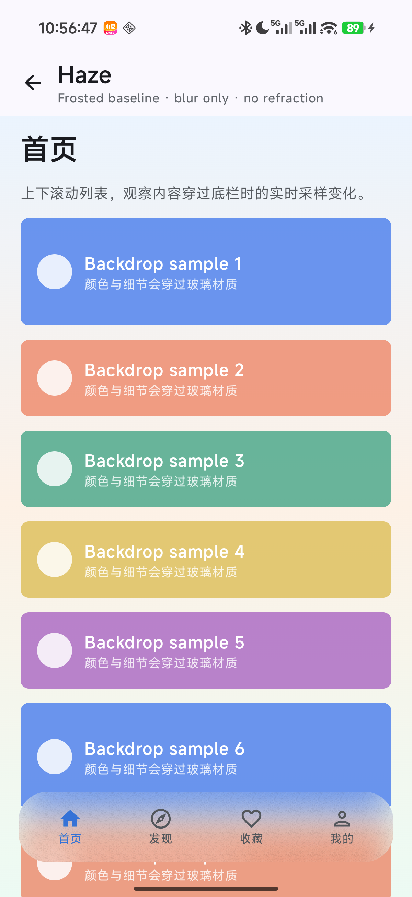
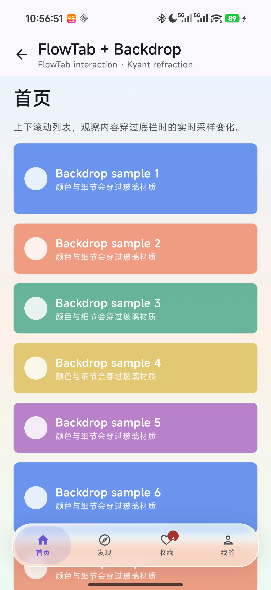
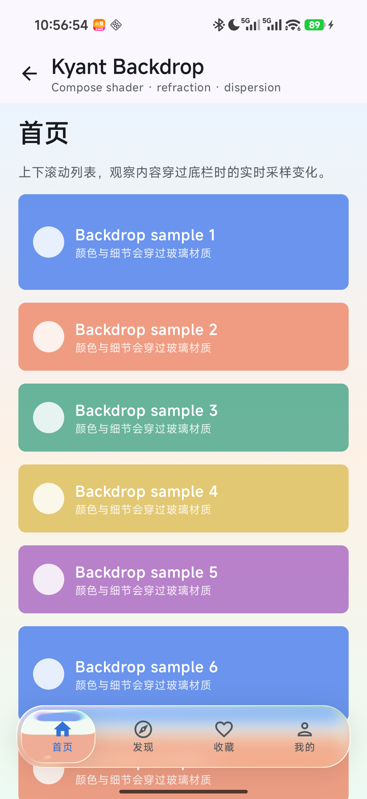
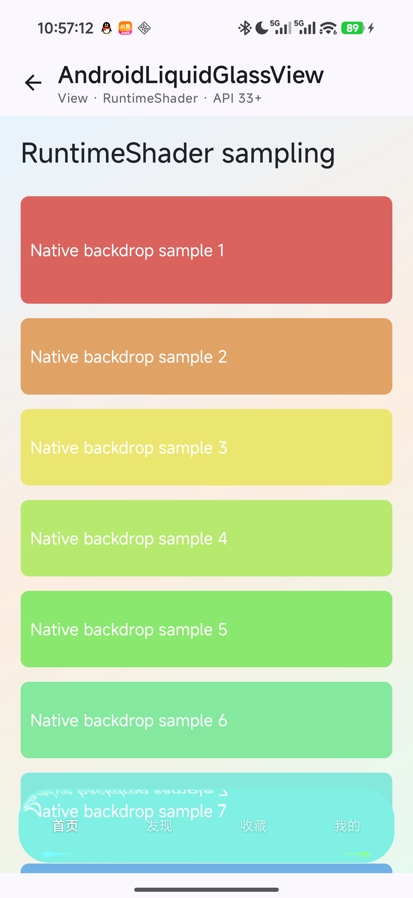
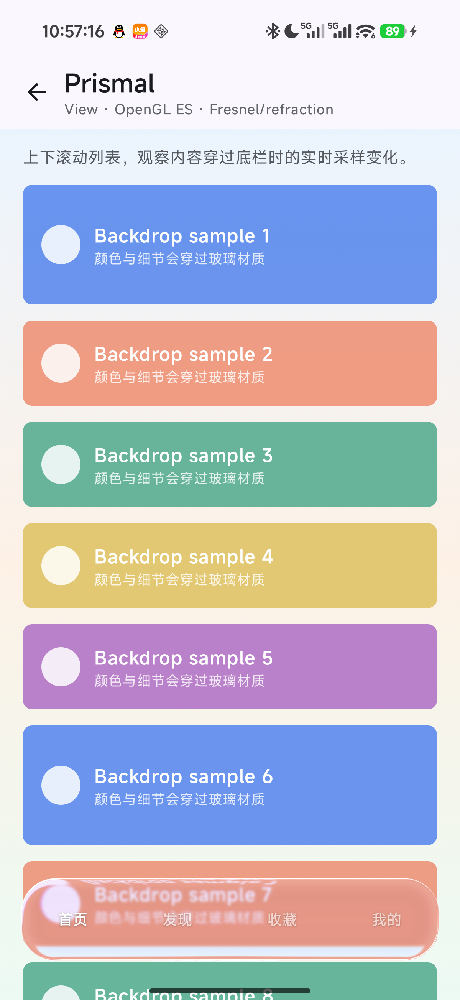

# Liquid Glass Lab

一个用于比较 Android 底部液态玻璃导航实现的实验项目。项目重点区分普通高斯模糊与真正的折射、色散、Fresnel 和动态背景采样。



## Demo 方案

| 方案 | 渲染方式 | 定位 |
| --- | --- | --- |
| Haze | Compose 高斯模糊 | 磨砂玻璃对照组，不包含折射 |
| FlowTab + Backdrop | FlowTab 交互 + Kyant Backdrop Shader | 带拖拽切换交互的液态折射底栏 |
| Kyant Backdrop | Compose RuntimeShader | 折射、色散和可拖拽液态选中胶囊 |
| AndroidLiquidGlassView | AGSL RuntimeShader + 实时 Bitmap 采样 | View 体系的动态液态折射，API 33+ |
| Prismal | OpenGL ES | 折射、Fresnel 与高光 |

## 运行截图

| Haze（磨砂对照组） | FlowTab + Backdrop |
| --- | --- |
|  |  |

| Kyant Backdrop | AndroidLiquidGlassView |
| --- | --- |
|  |  |

| Prismal |
| --- |
|  |

## AndroidLiquidGlassView 实时采样说明

原版 `AndroidLiquidGlassView` 使用 RenderNode 录制目标 View。目标是 `ScrollView` 时，硬件显示列表可能持续复用初始内容，导致列表滚动后玻璃纹理不更新。

本项目保留该库提供的 `liquidglass_effect.agsl` 着色器，并在 `LiveQmGlassBackdrop` 中：

- 直接采样滚动内容容器，跳过 `ScrollView` 的缓存显示列表；
- 使用 `getLocationInWindow()` 计算当前滚动位置；
- 通过独立帧循环刷新 Bitmap 输入；
- 将导航文字与玻璃背景分层绘制。

因此第四种 Demo 是面向实时滚动场景的修正版，不是原库组件的原样调用。

## 环境要求

- Android Studio 或 Android SDK 命令行工具
- JDK 17
- Android SDK 37
- 最低 Android 7.1（API 25）
- AndroidLiquidGlassView Demo 需要 Android 13（API 33）或更高版本

## 构建运行

```bash
git clone https://github.com/caochuankuan/liquid-glass-lab.git
cd liquid-glass-lab
./gradlew :app:assembleDebug
adb install -r app/build/outputs/apk/debug/app-debug.apk
```

也可以直接使用 Android Studio 打开项目并运行 `app` 配置。

## 主要依赖

- [Haze](https://github.com/chrisbanes/haze)
- [FlowTab-CMP](https://github.com/alims-repo/FlowTab-CMP)
- [Backdrop](https://github.com/Kyant0/Backdrop)
- [AndroidLiquidGlassView](https://github.com/QmDeve/AndroidLiquidGlassView)
- [Prismal](https://github.com/styropyr0/Prismal)
- Jetpack Compose、Material 3、Navigation 3

具体版本统一维护在 [`gradle/libs.versions.toml`](gradle/libs.versions.toml)。

## 许可证

项目采用 [MIT License](LICENSE)。
